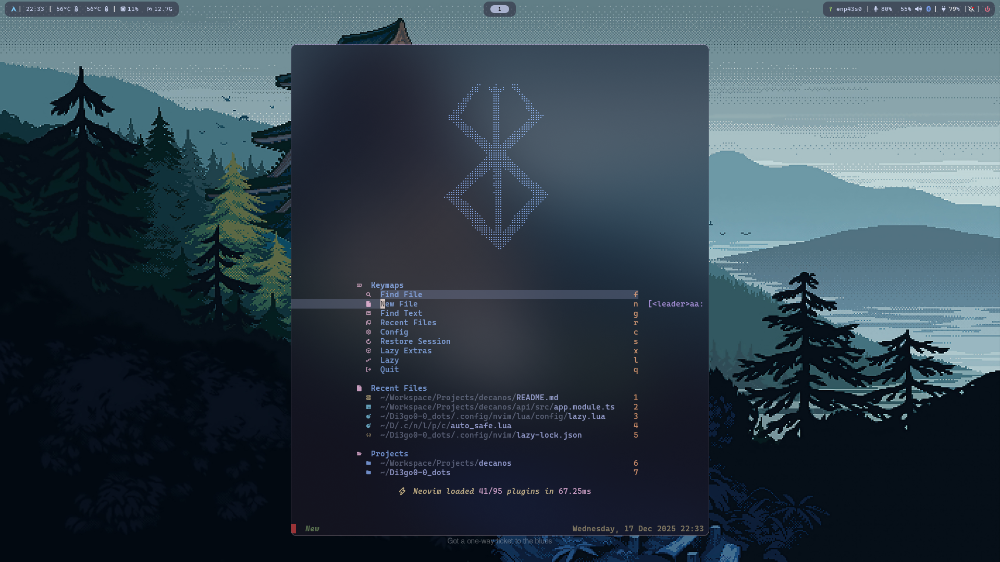

# Di3go0-0 | Personal Dots — `arch-hypr` branch

A clean, minimal and highly productive **Wayland-based Linux setup**, focused on performance, aesthetics, and developer ergonomics.

> **This branch (`arch-hypr`) is the portable base.** It carries the same configs as my daily setup but the installer is intentionally generic: it sets up the dependencies and symlinks needed for the dots to run, and stops there. Anything PC-specific (default shell, monitor layout, themes) is left to the user.

---

## Overview

My setup is divided into two main layers:

### Desktop Environment (Wayland)

* **Hyprland** – Dynamic Wayland compositor
* **Rofi** – Application launcher
* **Waybar** – Status bar
* **Wlogout** – Power menu

### Development & Terminal Stack

* **Neovim** – Code editor
* **Kitty** – GPU-accelerated terminal
* **Fish / Nushell** – Interactive shells
* **Starship** – Prompt
* **Zellij** – Terminal multiplexer

This combination gives me a fast, keyboard-driven workflow with full control over visuals and behavior.

---

## Install

Tested on Arch Linux. Run from inside the cloned repo:

```bash
./init.sh        # or: ./setup.sh
```

### What the base installer does

1. **`packages.sh`** — installs `yay` + the base package set: Hyprland stack, kitty, fish, nushell, nvim, waybar, rofi, swaync, wlogout, audio (pipewire), fonts, etc. **Personal apps (chrome, bitwarden, dbeaver, spotify) are NOT installed.**
2. **`backup-critical.sh`** — backs up SSH keys, GPG, browser prefs, AWS/kube/docker creds, etc. before any symlink.
3. **`symlink.sh`** — symlinks every folder under `.config/` of this repo into `~/.config/`, plus the wallpapers under `~/Pictures/wallpapers/`.
4. **`post-setup.sh`** — refreshes font/icon caches and bootstraps the wallust theme.

### What it does NOT do

- ❌ Change your default shell (no `chsh`).
- ❌ Touch monitor configuration. Edit `~/.config/hypr/monitors.lua` for your hardware.
- ❌ Install themes (GRUB/SDDM/Spicetify) automatically.

### Optional manual scripts

Run only what you want after the base install:

```bash
bash scripts/nushell.sh                # nushell plugins (zoxide, carapace, atuin, starship)
bash scripts/fish.sh                   # fisher + fish plugins (fzf.fish, nvm.fish, plugin-pj)
bash scripts/grub.sh                   # GRUB theme
bash scripts/spotify.sh                # Spotify + Spicetify
bash scripts/sddm-astronaut-setup.sh   # SDDM theme

# default shell — pick yours:
chsh -s "$(which fish)"
# or: chsh -s "$(which nu)"
```

---

## Repository Structure

```text
.
├── init.sh                 # entry point → runs setup.sh
├── setup.sh                # base installer (packages + symlinks + post-setup)
├── Readme.md
├── Resources/
│   ├── Font.png
│   └── wallpapers/
├── scripts/
│   ├── packages.sh         # base packages (no personal apps)
│   ├── backup-critical.sh  # backs up ssh/gpg/aws/etc before symlinking
│   ├── symlink.sh          # ~/.config/* → repo/.config/*
│   ├── post-setup.sh       # font/icon cache, wallust bootstrap
│   ├── verify.sh           # sanity check after install
│   ├── nushell.sh          # manual: nushell plugins (no chsh)
│   ├── fish.sh             # manual: fisher + fish plugins (no chsh)
│   ├── grub.sh             # manual: GRUB theme
│   ├── spotify.sh          # manual: Spicetify
│   └── sddm-astronaut-setup.sh  # manual: SDDM theme
└── .config/                # symlinked into ~/.config/
```

---

## Why This Configuration

### Hyprland

* True Wayland compositor with smooth animations
* Tiling + dynamic layouts
* Extremely configurable
* Excellent performance on modern GPUs

Hyprland allows me to keep a **minimal UI** while still having powerful window management.

---

### Rofi

* Fast application launcher
* Scriptable and themeable
* Keyboard-first interaction

Rofi keeps me out of menus and inside the keyboard flow.

---

### Waybar

* Modular status bar
* Full Wayland support
* Highly customizable via CSS and JSON

Waybar gives visibility without clutter.

---

### Wlogout

* Clean power menu for Wayland
* Keyboard and mouse friendly

Simple, visual, and consistent with the rest of the setup.

---

### Neovim

* Modal editing
* Lua-based configuration
* Massive plugin ecosystem

Neovim is the core of my development workflow.

---

### Kitty

* GPU accelerated
* Low latency
* Great font rendering

Kitty pairs perfectly with Neovim and Zellij.

---

### Fish & Nushell

* **Fish**: user-friendly, great defaults, strong autocompletion
* **Nushell**: structured data, modern shell philosophy

I switch between them depending on the task.

---

### Starship

* Fast
* Cross-shell
* Fully customizable

My prompt shows only what matters:

* Current directory
* Git branch
* Command duration
* Time

---

### Zellij

* Terminal multiplexer
* Beginner-friendly
* Strong session management

Zellij lets me manage complex terminal workflows cleanly.

---

## Nerd Font

I use **CaskaydiaCove Nerd Font Mono** for my Hyprland setup.

**Download link:**

[https://github.com/ryanoasis/nerd-fonts/releases/download/v3.4.0/CascadiaCode.zip](https://github.com/ryanoasis/nerd-fonts/releases/download/v3.4.0/CascadiaCode.zip)

This font provides excellent readability and full Nerd Font icon support.

> ⚠️ This font choice may change in the future, but it represents the current setup.

---

## Philosophy

* Minimal UI, maximum control
* Keyboard-driven workflow
* Fast startup and low overhead
* Clear separation between system, UI, and development tools

This setup is built to **stay out of the way** and let me focus on thinking and building.

---

## Notes

* This repository reflects **my personal workflow**
* It is opinionated by design
* Not intended to be universal
* **Branch strategy:** `arch-hypr` is the portable base — meant to bootstrap any Arch + Hyprland box. Other branches (`hyprland`, `main`, ...) hold my per-PC tweaks. Only commit PC-agnostic changes to `arch-hypr`.

---

## 🤝 Contributing & Acknowledgements

Special thanks to [Gentleman-Programming](https://github.com/Gentleman-Programming) and [Nikolov Lazar](https://github.com/nikolovlazar) for the inspiration.

Feel free to fork this repo and adapt it to your own workflow!
