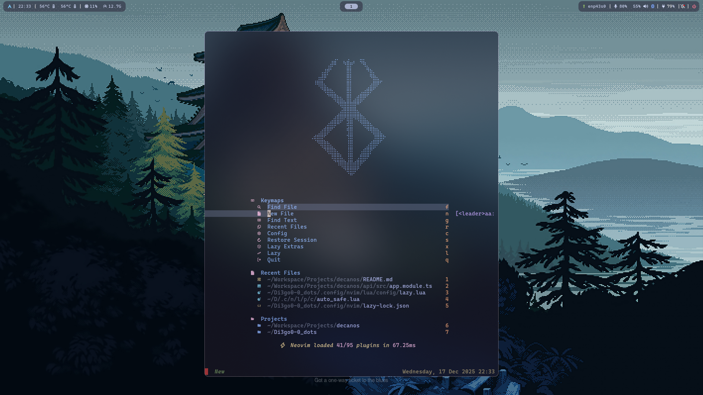

# Di3go0-0 | Personal Dots

A clean, minimal and highly productive **Wayland-based Linux setup**, focused on performance, aesthetics, and developer ergonomics.

This repository is **no longer an installation guide**. It is a **presentation** of my personal environment, tools, and workflow philosophy.

---

## Overview

My setup is divided into two main layers:

### Desktop Environment (Wayland)

* **Hyprland** – Dynamic Wayland compositor
* **Rofi** – Application launcher
* **Waybar** – Status bar
* **Wlogout** – Power menu

### Development & Terminal Stack

* **Neovim** – Code editor
* **Kitty** – GPU-accelerated terminal
* **Fish / Nushell** – Interactive shells
* **Starship** – Prompt
* **Zellij** – Terminal multiplexer

This combination gives me a fast, keyboard-driven workflow with full control over visuals and behavior.

---

## Repository Structure

```text
.
├── init.sh
├── PostingClient.md
├── Readme.md
├── Resources
│   ├── Font.png
│   └── wallpapers
├── scripts
│   ├── grub.sh
│   ├── imagen.sh
│   ├── nushell.sh
│   ├── packages.sh
│   ├── sddm-astronaut-setup.sh
│   ├── spotify.sh
│   └── symlink.sh
└── stow.md
```

### Entry Point

To initialize the entire setup:

```bash
./init.sh
```

The `init.sh` script orchestrates all other scripts and prepares the environment automatically.

---

## Why This Configuration

### Hyprland

* True Wayland compositor with smooth animations
* Tiling + dynamic layouts
* Extremely configurable
* Excellent performance on modern GPUs

Hyprland allows me to keep a **minimal UI** while still having powerful window management.

---

### Rofi

* Fast application launcher
* Scriptable and themeable
* Keyboard-first interaction

Rofi keeps me out of menus and inside the keyboard flow.

---

### Waybar

* Modular status bar
* Full Wayland support
* Highly customizable via CSS and JSON

Waybar gives visibility without clutter.

---

### Wlogout

* Clean power menu for Wayland
* Keyboard and mouse friendly

Simple, visual, and consistent with the rest of the setup.

---

### Neovim

* Modal editing
* Lua-based configuration
* Massive plugin ecosystem

Neovim is the core of my development workflow.

---

### Kitty

* GPU accelerated
* Low latency
* Great font rendering

Kitty pairs perfectly with Neovim and Zellij.

---

### Fish & Nushell

* **Fish**: user-friendly, great defaults, strong autocompletion
* **Nushell**: structured data, modern shell philosophy

I switch between them depending on the task.

---

### Starship

* Fast
* Cross-shell
* Fully customizable

My prompt shows only what matters:

* Current directory
* Git branch
* Command duration
* Time

---

### Zellij

* Terminal multiplexer
* Beginner-friendly
* Strong session management

Zellij lets me manage complex terminal workflows cleanly.

---

## Nerd Font

I use **CaskaydiaCove Nerd Font Mono** for my Hyprland setup.

**Download link:**

[https://github.com/ryanoasis/nerd-fonts/releases/download/v3.4.0/CascadiaCode.zip](https://github.com/ryanoasis/nerd-fonts/releases/download/v3.4.0/CascadiaCode.zip)

This font provides excellent readability and full Nerd Font icon support.

> ⚠️ This font choice may change in the future, but it represents the current setup.

---

## Philosophy

* Minimal UI, maximum control
* Keyboard-driven workflow
* Fast startup and low overhead
* Clear separation between system, UI, and development tools

This setup is built to **stay out of the way** and let me focus on thinking and building.

---

## Notes

* This repository reflects **my personal workflow**
* It is opinionated by design
* Not intended to be universal

---

## License

Use anything you find useful.

Adapt it.
Break it.
Improve it.

---

🚀
